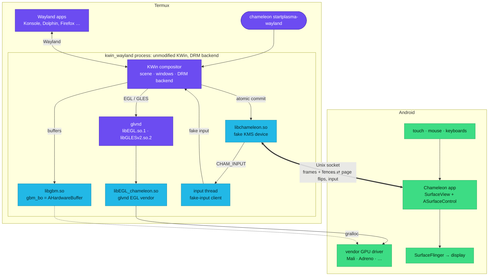
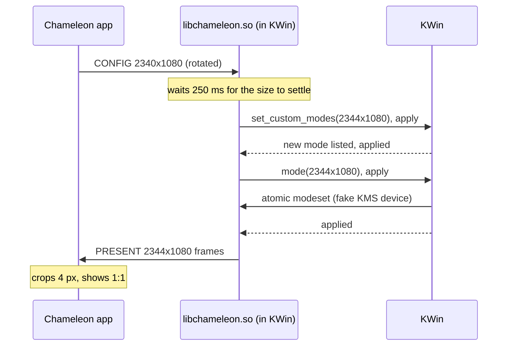
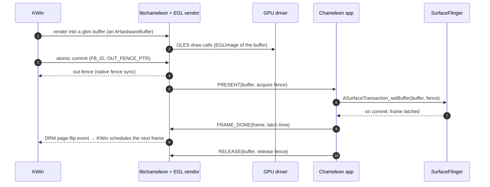
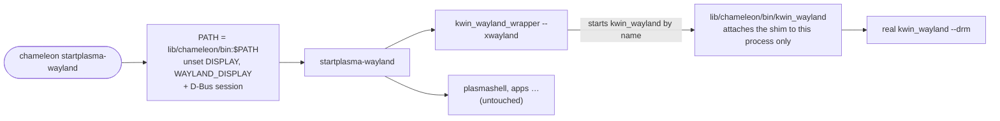

<p align="center">
  
</p>

<h1 align="center">Project Chameleon</h1>

<p align="center">
  <b>Linux Wayland desktops from Termux, shown in an Android app and drawn by the phone's own GPU.</b><br>
  Unmodified compositors (KWin and Plasma today) · vendor GLES driver · zero-copy <code>AHardwareBuffer</code>s · no root
</p>

<p align="center">
  <a href="../../actions/workflows/build.yml"></a>
</p>

---

Chameleon gives Linux graphics software in Termux what it expects from a PC
with a real graphics card, backed by Android: a display, GPU buffers and a GPU
driver. The first target is the stock Termux build of **KWin**, with a whole
Plasma session on top of it:

- KWin runs with its normal **DRM backend**, not nested inside another
  compositor, and without a single patch.
- Rendering goes through Android's **vendor GPU driver** (Mali, Adreno, …)
  via EGL/GLES. It doesn't use a software rasteriser.
- Finished frames travel to an Android app as **`AHardwareBuffer`s plus
  fences**. The pixels are never copied through the CPU.
- Touch (as a touchscreen or a trackpad), mouse, hardware keyboards and the
  Android on-screen keyboard are fed back into KWin.

It works by giving KWin the few things it expects from a Linux PC, a KMS
display device, GBM buffers and an EGL driver, all backed by Android APIs.
The same pieces are meant to carry other Wayland compositors and apps later;
the EGL driver already renders Wayland apps on the GPU.

## How it works

> The diagrams are interactive on GitHub: use the controls in the corner of
> each one to zoom, pan or open it full screen.



Purple is KDE/Termux software as shipped, blue is Chameleon's shim, and green
is Android. KWin and the app talk over one Unix socket,
`$PREFIX/tmp/chameleon-0`.

<details>
<summary><b>🦎 The Chameleon app</b>: Android side, shows frames and collects input</summary>

- A full-screen `SurfaceView` whose `ASurfaceControl` receives KWin's buffers
  with `ASurfaceTransaction_setBuffer`, together with KWin's acquire fence.
- It reports the surface size and the panel's fastest refresh rate to KWin
  (`CONFIG`). KWin sees them as the mode of a DSI connector, and the screen
  follows the window when it rotates or resizes (see *Screen size* below).
  Settings choose the orientation (rotate with the phone, portrait or
  landscape) and whether the keyboard shrinks the desktop or covers it.
- **Page flips:** when SurfaceFlinger latches a frame, the app sends
  `FRAME_DONE`, which the shim turns into KWin's page-flip event. KWin's
  frame pacing therefore follows the real display.
- **Back from the background:** Android destroys the surface while the app
  is hidden. The app keeps its copy of the last frame and shows it again on
  the new surface, since KWin only draws when something changes.
- **Input:** touches are sent as direct touch or trackpad gestures (your
  choice in settings). Mouse and hardware keys are forwarded, and the
  on-screen keyboard comes with an extra row (Esc, Tab, sticky Ctrl/Alt,
  arrows, Home/End, PgUp/PgDn).
- **Same user as Termux:** the APK is signed with Termux's public GitHub test
  key and declares `sharedUserId="com.termux"`. That's why it can listen on
  `$PREFIX/tmp/chameleon-0`, and why it needs Termux from GitHub releases.

Code: [`android/`](android/) · protocol: [`common/chameleon_proto.h`](common/chameleon_proto.h)
</details>

<details>
<summary><b>🖥️ libchameleon.so</b>: a fake KMS display device for KWin</summary>

- Preloaded into `kwin_wayland` only. Opening
  `$PREFIX/tmp/chameleon-card0` (KWin finds it through `KWIN_DRM_DEVICES`)
  returns a pipe that behaves like a DRM card: `stat()` says it's a character
  device, and every DRM `ioctl` on it is answered in user space.
- It offers one connector, one CRTC and one primary plane, with atomic
  modesetting, `TEST_ONLY` commits, `EBUSY` while a flip is pending, and
  page-flip events written to the pipe.
- An atomic commit sends a `PRESENT` to the app with the framebuffer's
  `AHardwareBuffer` and KWin's out-fence. If the app is closed, a simulated
  vblank keeps KWin running.
- It also contains the input thread and a crash reporter that logs the last
  GL/EGL calls and a symbolised backtrace.

Code: [`shim/core/`](shim/core/)
</details>

<details>
<summary><b>🧱 libgbm.so</b>: GBM buffers are AHardwareBuffers</summary>

- A complete `libgbm` API: every `gbm_bo` is an `AHardwareBuffer` allocated
  through gralloc.
- A buffer's dmabuf fd is the gralloc handle's own dmabuf, so KWin's usual
  path (gbm → PRIME fd → `DRM_IOCTL_MODE_ADDFB2` → EGL import) works
  unchanged.

Code: [`shim/gbm/`](shim/gbm/)
</details>

<details>
<summary><b>🎨 libEGL_chameleon.so</b>: a glvnd EGL vendor for Android's GPU driver</summary>

- Termux programs link glvnd's `libEGL.so.1` / `libGLESv2.so.2`, which load
  *vendor* libraries. Chameleon is one: glvnd asks it for displays and for
  every EGL and GL entry point, and it hands out Android's
  `libEGL.so` / `libGLESv2.so`, i.e. the vendor driver.
- **Inside KWin**, it adds what a Mesa GBM stack provides: the GBM platform,
  and `EGL_EXT_image_dma_buf_import`, which imports a Chameleon buffer as its
  `AHardwareBuffer` through `EGL_NATIVE_BUFFER_ANDROID`.
- **Driver workarounds:** it rewrites GLSL `#if GL_ext` to
  `#if defined(GL_ext)` (Mesa tolerates the bare form; strict drivers don't).
  It can also hide extensions and drop context attributes that a driver
  mishandles.
- **Wayland apps on the GPU:** under a Chameleon KWin it also takes
  `EGL_PLATFORM_WAYLAND_KHR`. Each `wl_egl_window` renders into an
  `AImageReader`, a real Android window surface, so the driver's buffer
  handling works as usual. Every frame then reaches KWin as an
  `AHardwareBuffer`: it is registered with KWin's shim, wrapped in a
  `zwp_linux_dmabuf_v1` buffer and committed on the app's surface. Nothing
  is copied, and frame callbacks pace the app.
- **Qt without a rebuild:** Android's driver speaks OpenGL ES only, while
  Termux's Qt is built for desktop OpenGL. Qt already switches to OpenGL ES
  on EGL implementations without desktop GL, as it does for NVIDIA's. So in
  Qt apps on its Wayland platform, the vendor reports an EGL vendor string
  that triggers that path, and stock Qt Quick apps (plasmashell, System
  Settings…) render on the GPU. `CHAMELEON_EGL_QT=mesa` leaves them to Mesa.
- **Scope:** apps that need desktop OpenGL itself, X11 windows, and Wayland
  windows under any other compositor still go to Mesa.

Code: [`shim/vendor/`](shim/vendor/), [`shim/egl/`](shim/egl/), [`shim/gles/`](shim/gles/)
</details>

<details>
<summary><b>⌨️ Input</b>: from Android touch to KWin</summary>

- The app sends `CHAM_INPUT` messages over the same socket: touch points,
  relative/absolute pointer motion, buttons, scroll and X keysyms. Positions
  are fractions of the surface.
- KWin always runs its **fake-input** backend and trusts clients from its own
  process. The shim's input thread therefore connects to KWin's own Wayland
  socket and binds `org_kde_kwin_fake_input`. It scales positions to the
  output's logical size (`xdg_output`), so display scaling just works.
- Keys are keysyms, so KWin looks them up in its keymap (adding Shift when
  needed) or maps them to a spare key. That's why text in any language,
  typed on the Android keyboard, arrives as typed.

Code: [`shim/core/input.c`](shim/core/input.c), [`android/…/TouchInput.java`](android/app/src/main/java/io/github/harryl0l/chameleon/TouchInput.java), [`KeyInput.java`](android/app/src/main/java/io/github/harryl0l/chameleon/KeyInput.java)
</details>

<details>
<summary><b>🔄 Screen size</b>: rotation and the keyboard resize the desktop</summary>

- Rotating the phone, or opening the keyboard with *Shrink the desktop above
  the keyboard* on, changes the app's surface size, and the app sends a new
  `CONFIG`.
- Termux's KWin has no udev, so it can't learn about the change as a
  hotplug. Instead the shim asks KWin the way System Settings does: over the
  same Wayland connection as input, it uses `kde_output_management_v2`. It
  picks an existing mode of that size, or adds a custom mode
  (`set_custom_modes`, replacing the one it added before) and then picks it.
- KWin then does an ordinary modeset on the fake device, which accepts any
  mode size, and lays out panels and windows for the new screen.
- KWin's custom modes have widths in multiples of 8, so the width is rounded
  up and the app crops the few extra pixels, keeping the image sharp. Input
  is mapped to the visible part.
- Only a change of the window counts, so a resolution picked by hand in
  System Settings stays until the window changes again. Until KWin has
  switched (or if it can't), the app scales the frame to fit and keeps its
  aspect ratio. `CHAMELEON_RESIZE=0` keeps KWin's screen at its first size.



Code: [`shim/core/output.c`](shim/core/output.c), [`presenter.cpp`](android/app/src/main/cpp/presenter.cpp) (`place()`)
</details>

### One frame, end to end



### Launch flow



No `--drm` flag or plasma-workspace change is needed: with neither
`WAYLAND_DISPLAY` nor `DISPLAY` set, KWin picks its DRM backend by itself.

## What a phone needs

Chameleon uses only public Android APIs and the phone's own GPU driver
(through `/system/lib64/libEGL.so` / `libGLESv2.so`); no root, no access to
`/dev/dri`, no Vulkan and no desktop OpenGL. What the driver must offer:

**System**

| | Needed for |
|---|---|
| arm64 (aarch64), **Android 10** (API 29) or newer | the app (`ASurfaceControl`) and Termux |
| [Termux from GitHub releases](https://github.com/termux/termux-app/releases) | the app shares its signing key to run as the Termux user |
| `AHardwareBuffer` (API 26) that can be allocated as RGBA8888 / RGBX8888 with `GPU_SAMPLED_IMAGE \| GPU_COLOR_OUTPUT`, and sent over a Unix socket | every frame: KWin's output and app buffers |
| a dmabuf inside the gralloc handle (`AHardwareBuffer_getNativeHandle`) | buffers are matched across processes by it |
| `AImageReader` from `libmediandk` (API 26) | GPU rendering for Wayland apps; without it apps fall back to Mesa |
| Android sync fences (sync_file) | acquire/release fences between KWin, apps and the app |

**EGL** (1.4 or newer)

| Extension | | Needed for |
|---|---|---|
| `EGL_KHR_image_base`, `EGL_ANDROID_image_native_buffer` | required | `AHardwareBuffer` → `EGLImage` (KWin's buffers, app buffers) |
| `EGL_ANDROID_get_native_client_buffer` | required | the same, from an `AHardwareBuffer` handle |
| `EGL_KHR_no_config_context` | required | KWin refuses to start without it |
| `EGL_KHR_surfaceless_context` | required | KWin refuses to start without it |
| `EGL_ANDROID_native_fence_sync` + `EGL_KHR_wait_sync` | recommended | fences for KWin's commits; without them KWin falls back to `glFinish()` |
| `EGL_KHR_fence_sync` | recommended | sync objects |

**OpenGL ES** (what KWin checks, `EglContext::checkSupported`)

| Requirement | | Needed for |
|---|---|---|
| **OpenGL ES 3.0** or newer (or 2.0 + `GL_OES_texture_3D`) | required | KWin's renderer; 3.2 recommended |
| `GL_OES_EGL_image` (`glEGLImageTargetTexture2DOES`) | required | textures from `EGLImage`s |
| `GL_EXT_unpack_subimage` | required | KWin's texture uploads |
| `GL_EXT_read_format_bgra` | required | KWin's screenshots / read-backs |
| `GL_OES_EGL_image_external` | optional | external-only buffer formats |

Qt, GTK and other apps need nothing beyond this: Qt built for desktop OpenGL
is steered onto OpenGL ES automatically.

Run `chameleon-probe` on the phone to check all of it. It lists every
extension above as PASS / FAIL / WARN, allocates and renders into an
`AHardwareBuffer`, passes it across a socket, and renders an `AImageReader`
frame. Driver quirks found along the way (a GLSL construct the driver
rejects, an extension that misbehaves) are worked around in the EGL vendor
rather than required of the phone.

## Getting started

**Requirements:** see [What a phone needs](#what-a-phone-needs), plus
[Termux from GitHub releases](https://github.com/termux/termux-app/releases)
with KWin installed.

1. Download the `chameleon-<commit>` artifact from the latest
   [Actions run](../../actions/workflows/build.yml) and unzip it.
2. Install `chameleon.apk` and open **Chameleon**.
3. In Termux, install the package, then start a session:

   ```sh
   apt install /sdcard/Download/chameleon-*/chameleon_*_aarch64.deb
   ```

   Then start either KWin with a terminal:

   ```sh
   chameleon kwin_wayland konsole
   ```

   or a full Plasma session:

   ```sh
   chameleon startplasma-wayland
   ```

   Without the package, the artifact's `chameleon/` folder works too. Copy it
   into Termux (not `/sdcard`, which is `noexec`), run
   `chmod +x chameleon/chameleon* chameleon/bin/*`, then
   `chameleon/chameleon --install` to put `chameleon` in `$PATH`.

4. Switch to the app. The ⌨️ button opens the keyboard, and ⚙️ switches between
   **direct touch** and **trackpad** (tap to click, two-finger tap for right
   click, two-finger drag to scroll, tap-and-drag to hold).

**Optional:** `chameleon-vendor-install` registers the EGL vendor with glvnd
for all Termux programs (`--remove` undoes it; removing the package does too).

The package also installs `chameleon-probe`, which checks a device's EGL,
AHardwareBuffer and AImageReader support, and `chameleon-demo`, a minimal
zero-copy producer for the app.

## Repository layout

| Path | What |
|---|---|
| [`android/`](android/) | The Chameleon app: presenter (C++, `ASurfaceControl`), input, settings |
| [`common/`](common/) | Socket protocol shared by both sides |
| [`shim/core/`](shim/core/) | `libchameleon.so`: fake KMS device, presenter link, input, screen size, crash reporter |
| [`shim/gbm/`](shim/gbm/) | Fake `libgbm.so` on `AHardwareBuffer` |
| [`shim/vendor/`](shim/vendor/), [`shim/egl/`](shim/egl/), [`shim/gles/`](shim/gles/) | `libEGL_chameleon.so`, the glvnd EGL vendor |
| [`shim/bin/`](shim/bin/), [`shim/chameleon`](shim/chameleon) | Launchers |
| [`shim/test/`](shim/test/) | Host tests: fake KMS with real libdrm, input and screen size with real libwayland, vendor with real glvnd |
| [`probe/`](probe/) | `ahb_probe`: checks a device's EGL / AHardwareBuffer / fence support |
| [`termux/demo/`](termux/demo/) | `chameleon_demo`: minimal zero-copy producer |
| [`docs/`](docs/) | Design notes ([KWin integration](docs/kwin-integration.md)) |
| [`packaging/`](packaging/) | Termux `.deb` packaging |
| [`branding/`](branding/) | Logo and launcher-icon generator |

## Building

Everything builds on GitHub Actions ([`build.yml`](.github/workflows/build.yml)).
Each push produces one artifact: the APK, the Termux package
(`chameleon_<version>_aarch64.deb`, built by
[`packaging/build-deb.sh`](packaging/build-deb.sh)), the same files as a
plain `chameleon/` folder, and the probe and demo. It also runs the host tests.

Locally:

```sh
gradle -p android assembleDebug                                       # the app
CC=$NDK/toolchains/llvm/prebuilt/linux-x86_64/bin/aarch64-linux-android29-clang \
    shim/build-android.sh out/chameleon                               # the shim
packaging/build-deb.sh out/chameleon out/ahb_probe out/chameleon_demo 0.1.0 out/
shim/test/run-host-test.sh     # needs libdrm-dev libwayland-dev libegl-dev libgles-dev
```

## Roadmap

- [x] Zero-copy presenter app with display-accurate frame pacing
- [x] Unmodified KWin on a fake KMS device, rendering on the vendor GPU driver
- [x] Touch, trackpad, mouse and keyboard input
- [x] EGL/GLES as a glvnd vendor; `chameleon <session>` launcher
- [x] GPU rendering for Wayland apps (Wayland platform in the EGL vendor)
- [x] Screen resize and rotation (keyboard-aware resizing)
- [ ] Xwayland acceleration

## Notes

- Not affiliated with KDE, Termux or Google. The "W" disc in the logo is a
  stylised nod to Wayland, not the official Wayland logo.
- Licence: [GPL-2.0-or-later](LICENSE), like KWin, whose process
  `libchameleon.so` runs in. `shim/include/` vendors MIT-licensed headers
  from libdrm, Mesa (`gbm.h`) and libglvnd, which keep their own licences.
